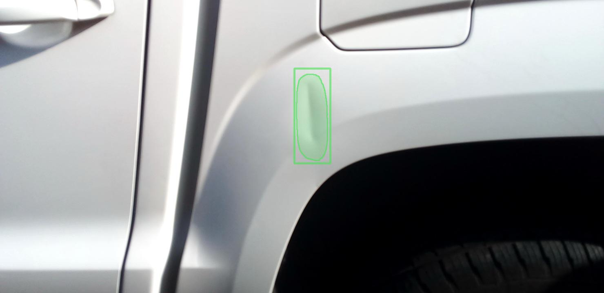

# Data Science Portfolio

---

## Machine learning & AI 

### CarScan_Assign-1

Here, the damaged parts of car, given in the form of metadata, have been visualized on the car images files. This is a kind of data visualization, usually done in Computer Vision using open-cv library. Additionaly, a notebook has also been provided for demo along with the main code.   

